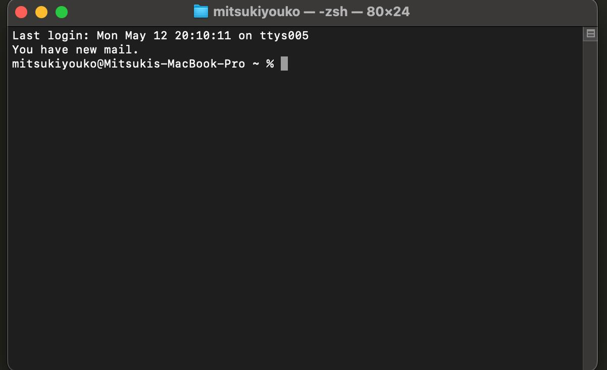
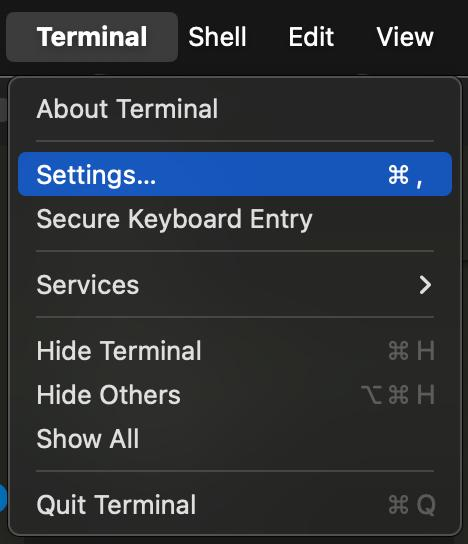
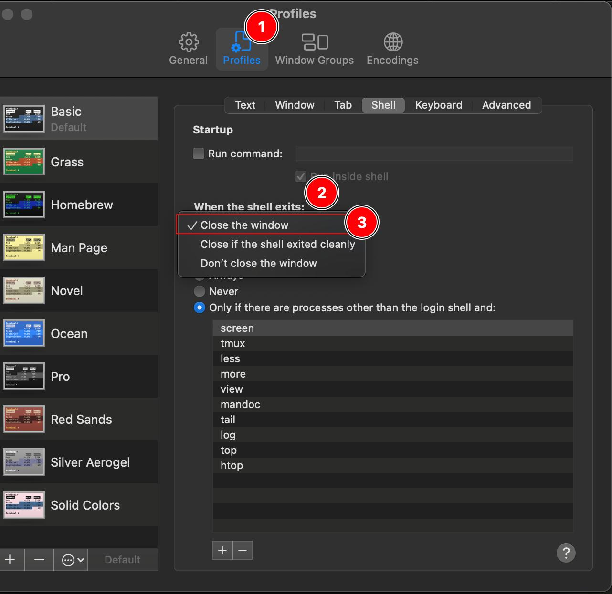
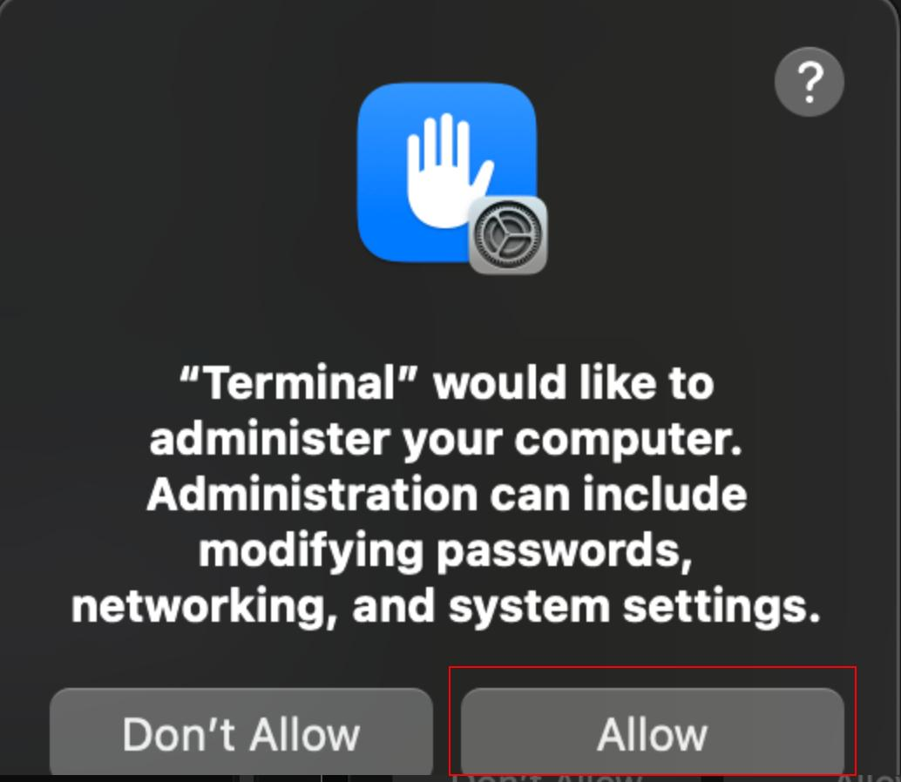

# It's Time for a Minibreak!

### Overview

This little script 'app' pops up a reminder to take a mini break every 15 minutes.

This is only available for Mac and Linux Machines at the moment.

### Mac Installation (and how to Uninstall)

IMPORTANT!!!

PREREQUISITE:

Before Installing this on a Mac, You'll need to do some set up as the Mac's terminal does not automatically close the terminal window upon exit for some strange reason..

You actually have to set it to do that...

1. Open a terminal
2. Go to Terminal > Settings, Select Profile > When the shell exits > Close the Window

If you skip this step, every time the pop up appears, it will leave behind a tab and soon you will have a bunch of terminal tabs open that don't close themselves..

Once you've completed this prerequisite, proceed to the installation steps.

##### Install
1. Download the code for this Repo
2. Open a Terminal
3. cd to the minibreak folder where you downloaded it.
4. If you would like to use the default cron job duration of 15 minutes, Run the installer with ./installer.sh. (If it's not letting you run it, run chmod +x installer.sh)
5. If you get a pop up saying that "Terminal would like to administer your computer", click Allow. This only pops up because we are setting up a cron job, which requires admin priviledges.

6. Now, every 15 mins, a terminal should pop up with the minibreak display.

##### Uninstall
1. If you still have the minibreak folder somewhere, cd to it. Otherwise, redownload the code for this repo
2. Open a terminal
3. cd to the minibreak folder
4. run ./uninstaller.sh and if its not letting you run, try chmod +x uninstaller.sh.
5. If you get a pop up saying that "Terminal would like to administer your computer", click Allow. (Again, this is for the Cron job, of which we are now removing.)

To Manually remove (if the uninstaller script is not working), run the following commands:
1. crontab -l | grep -v "startminibreak.sh" | crontab
2. rm ~/.local/bin/startminibreak.sh
3. rm ~/.local/bin/minibreak.sh

##### Changing the Duration Between Pop Ups
1. Open the terminal
2. Run the following command to remove the 15 min crontab (If you want to add MORE durations on top of the existing 15 mins, then skip this step): `crontab -l | grep -v "startminibreak.sh" | crontab`
3. Use Crontab Guru to figure out how to structure the cron job to your liking. (https://crontab.guru)
4. In the terminal run `<your cron job duration> ~/.local/bin/startminibreak.sh`
Replace `<your cron job duration>` with something like * * * * * with the numbers replacing the asterisk of your choosing.

##### Changing the Content of the Minibreak

1. cd to ~/.local/bin
2. Use vim/nano (or an editor of choice) to edit minibreak.sh
3. Edit the minibreak script how you wish, then save and exit. The next time it runs, It'll display the updated info.

---

### Linux (GNOME ONLY) Installation (and how to Uninstall)

I haven't developed the Linux Version as much since I made this back when I was newer to linux than I am now... so there's a lot that can be improved here.. But since this is a simple for-fun project, I haven't gotten the chance to update it.

##### Install
1. Download the code for this Repo
2. Open a Terminal
3. cd to the minibreak folder where you downloaded it.
4. cp minibreak.sh and startminibreak.sh to wherever you'd like but ensure that the two are in the same location.
5. cd to ~/.bashrc
6. Vim or nano (or use your editor of choice) .bashrc
7. At the very bottom, add the following:
`alias minibreak='cd /path/to/minibreak-scripts && watch -n 900 ./call_minibreak.sh'`
8. Save and exit
9. Make sure you are in your home directory and type: source .bashrc
10. Now, when you want to run the minibreak script, just type minibreak in your terminal and once you've ran it for the first time since you logged in, it will keep running so long as you leave the terminal open.

##### Uninstall

1. Edit .bashrc like you did via the installation instructions but remove the alias line that was added.
2. cd to the folder that contains the 2 minibreak scripts and use rm to remove the 2 scripts.

##### Changing the Duration Between Pop Ups

Due to the `watch -n 900`, it will run every 900 seconds, aka 15 minutes. If you would like to change the duration, simply replace 900 with the number of seconds of your choosing. 

(Go through steps 5-9 again but with a different number of seconds)

##### Changing the Content of the Minibreak

1. cd to the folder that contains the 2 minibreak scripts
2. Use vim/nano (or an editor of choice) to edit minibreak.sh
3. Edit the minibreak script how you wish, then save and exit. The next time it runs, It'll display the updated info.